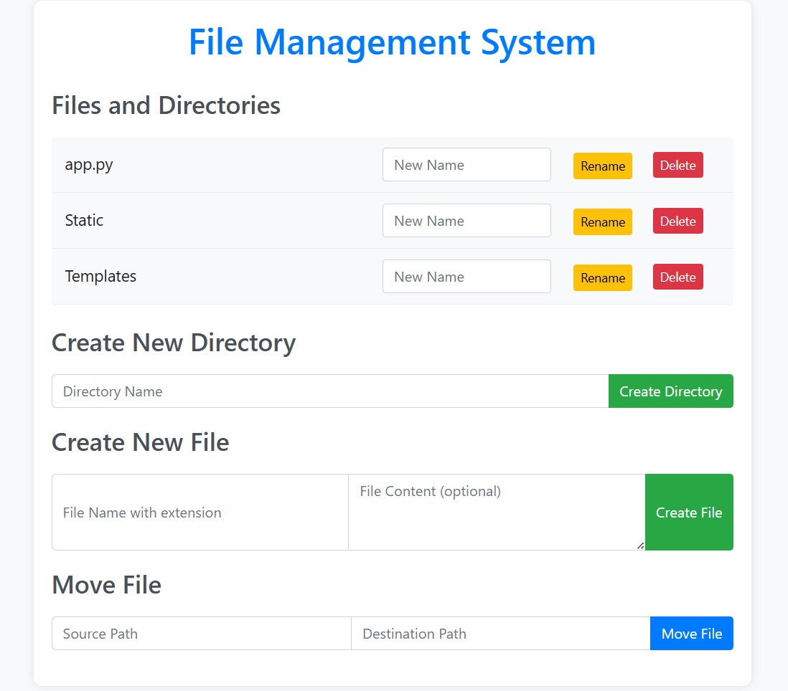

# File-Development-System

A lightweight browser-based file management tool built with Flask and Python. Perform basic file
and folder operations like create, delete, rename, and move directly from a user-friendly web
interface.

## 📸 Demo Screenshots

### 📁 Home Page

---
Features
- Create and delete files or directories
- Rename files or directories
- Move files between folders
- Flash messages for operation feedback
- Mobile-responsive UI using Bootstrap

---
How to Run Locally
1. Clone the repository
 git clone https://github.com/your-username/file-management-system.git
 cd file-management-system
2. Install dependencies
 pip install Flask
3. Run the Flask app
 python app.py
4. Visit the app in browser
 http://127.0.0.1:5000/

---
Implementation Details
- Backend: Python (Flask), using os and shutil for server-side file operations.
- Frontend: HTML + Bootstrap for styling and responsiveness.
- Templating: Jinja2 for rendering dynamic content and forms.
- Flash messages: Flask's flash() system is used to display success/error messages.
- Routes: Separate Flask routes for each operation (/create-directory, /rename, /delete, /move-file).
